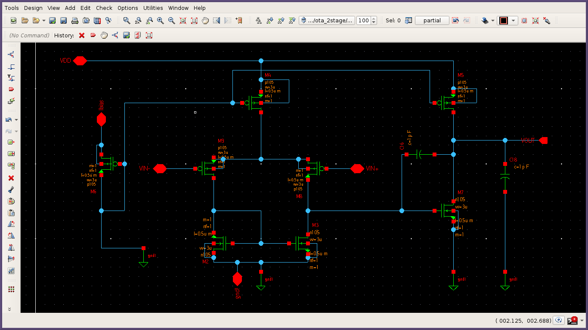
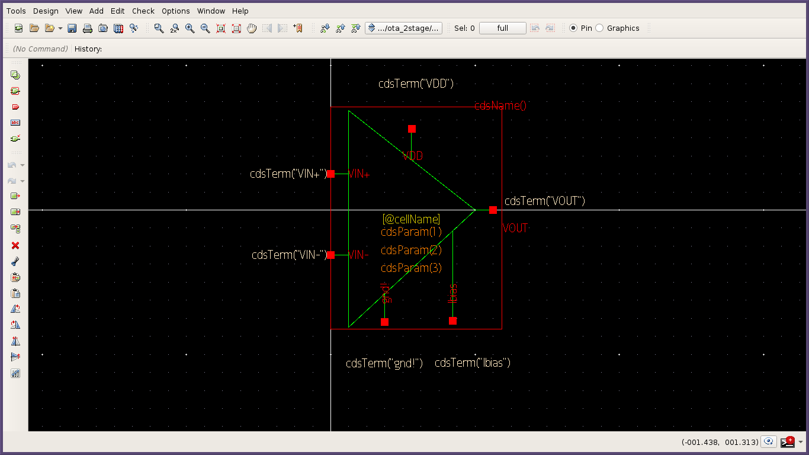
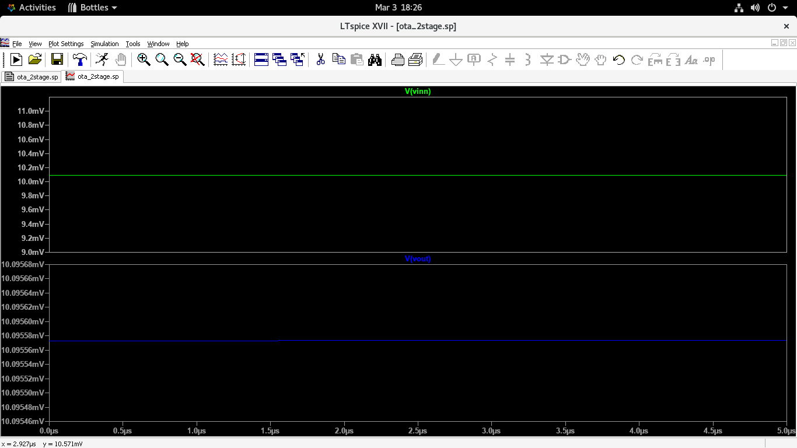
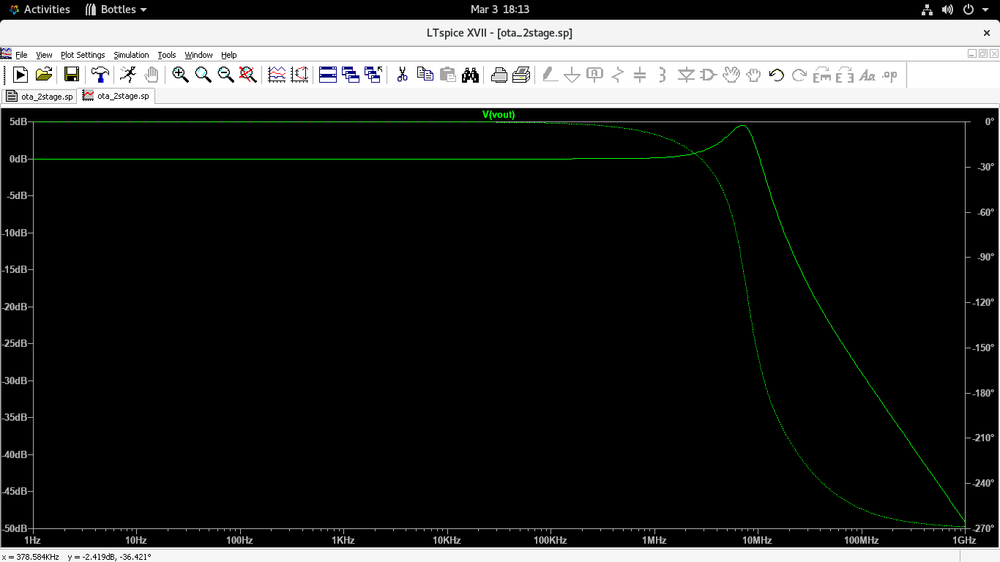

# 2-Stage Miller Compensated OTA Design

**Guided by: Siddharth Singh Parihar Sir**

---

## Project Description
This project focuses on the design and verification of a high-performance two-stage Operational Transimpedance Amplifier (OTA). The architecture utilizes a PMOS input differential pair for optimized noise performance and an NMOS active load. The design process covers the full analog flow: from schematic capture in **Synopsys Custom Compiler** to high-fidelity verification in **LTspice**. The primary design goal was balancing high DC gain with robust stability through frequency compensation.

## Performance Summary
| Parameter | Value |
| :--- | :--- |
| **DC Gain** | ~45 dB |
| **Gain Bandwidth (GBW)** | 10.3 MHz |
| **Phase Margin** | 48.6° |
| **Supply Voltage** | 1.05V |
| **Technology** | 105nm Generic MOS Models |

---

## Architecture & Design
The circuit utilizes a **Miller compensation capacitor (C16)** to perform pole-splitting. This technique ensures stability by moving the dominant pole to a lower frequency and the secondary pole to a much higher frequency, effectively preventing oscillations in closed-loop configurations.

### 1. Design Visuals
| OTA Schematic | OTA Symbol |
| :---: | :---: |
|  |  |

### 2. Testbench (TB) Setup
The verification environment uses a specialized feedback network to maintain DC bias while allowing for open-loop AC Characterization.

---

## Simulation Results

### 1. DC Operating Point (.OP)
DC analysis confirms that all transistors are biased in the **Saturation Region** ($V_{ds} > V_{gs} - V_{th}$). The output tracks the common-mode input of 0.5V with high precision.

### 2. AC Analysis (Bode Plot)
The Bode plot illustrates the open-loop frequency response. The Miller compensation successfully yields a stable phase margin of ~48.6°.

### 3. Transient Response
Verified in a unity-gain buffer configuration using a 1MHz sine wave. The output tracks the input with minimal distortion.

---

## Tools & Technology
* **Design Tool:** Synopsys Custom Compiler V-2023.12
* **Simulation Engine:** LTspice XVII
* **Technology:** 105nm Generic MOS Models
* **OS:** AlmaLinux 8 (Wine/Bottles for LTspice)

## How to Simulate
1. **Repository Setup**: Clone this repository and ensure the `/src` and `/sim` folders are intact.
2. **Open Testbench**: Open `sim/ota_master_testbench.sp` in LTspice.
3. **Choose Analysis**: Edit the simulation commands by toggling the comment character (`*`) to run either **.AC**, **.TRAN**, or **.OP**.
4. **Run**: Execute the simulation and use the trace tool to view `V(vout)`.

---
*Created as part of the Analog IC Design coursework under the mentorship of Siddharth Singh Parihar Sir.*
